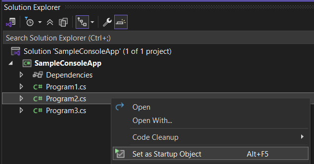
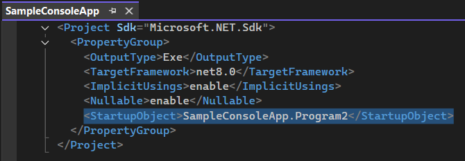

# Change Startup Object

Quickly change the Startup Object (entry point) of a project to the desired class.

This command is similar to "Set as Startup Project" but is designed for setting a class as an entry point at the project level, allowing multiple `Main` methods across different `.cs` files. 

## How It Works

When the command is executed, the selected class is set in the respective project as the `<StartupObject>`. This is a [compiler option](https://learn.microsoft.com/en-us/dotnet/csharp/language-reference/compiler-options/advanced#mainentrypoint-or-startupobject) that specifies the entry point of the application.

## Shortcut

Use `Alt+F5` to set the active file OR the selected file in Solution Explorer as the Startup Object.

## Use Cases

- When you don't want to create multiple projects just to have different entry points, such as small POCs and benchmarks using Console Applications.  
- A quick solution for [CS0017](https://learn.microsoft.com/en-us/dotnet/csharp/misc/cs0017) that eliminates the need to compile with the `/main` option.

## Limitations

- Doesn't work with [top-level statements](https://learn.microsoft.com/en-us/dotnet/csharp/fundamentals/program-structure/top-level-statements#only-one-top-level-file), since there is a limitation of only one top-level file per application.
- The selected class must have a `Main` method.
